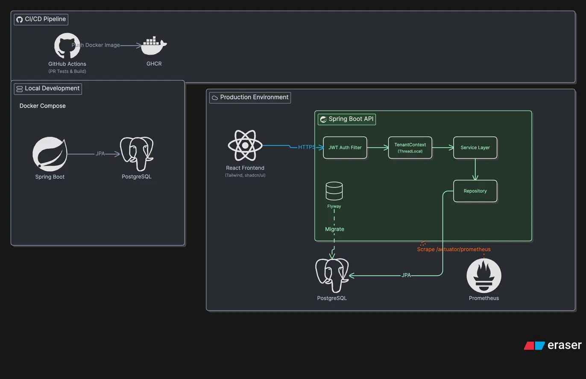
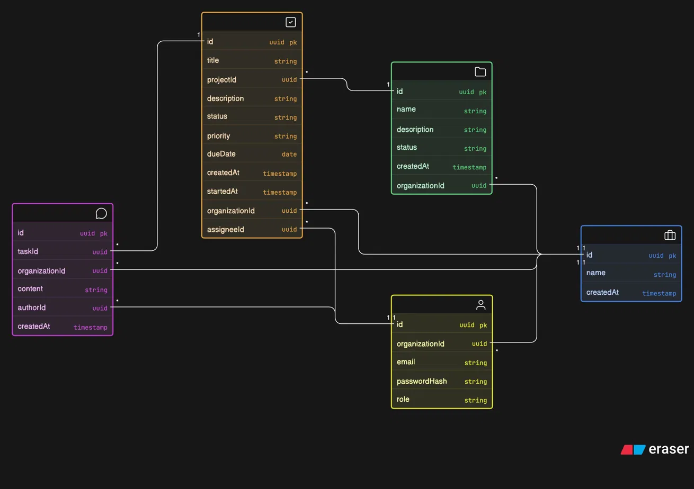

# Nexus — Multi-Tenant Task Management Platform


A production-grade fullstack task management platform with multi-tenant architecture. Multiple organizations share one application instance while their data remains completely isolated. Built as a portfolio project targeting backend, cloud/DevOps, and fullstack engineering roles.

---

## Table of Contents

- [Overview](#overview)
- [Tech Stack](#tech-stack)
- [Architecture](#architecture)
- [Domain Model](#domain-model)
- [API Reference](#api-reference)
- [Features](#features)
- [Project Structure](#project-structure)
- [Local Setup](#local-setup)
- [Testing](#testing)
- [CI/CD Pipeline](#cicd-pipeline)
- [Resume Bullets](#resume-bullets)

---

## Overview

Nexus is a multi-tenant task management platform where each organization operates in complete isolation — organizations never see each other's data. Tenant context is enforced at the service layer via organization-scoped JWT claims, not URL path parameters or request bodies, making it impossible for a misconfigured client to bleed data across tenants.

The project demonstrates end-to-end production engineering: JWT authentication, RBAC, a validated task status state machine, custom Prometheus metrics for SLA tracking, a Kanban board with drag-and-drop, an analytics dashboard, a multi-stage Docker build, and a GitHub Actions pipeline that tests on every PR and publishes to GHCR on merge.

---

## Tech Stack

### Backend

| Layer              | Technology                              |
| ------------------ | --------------------------------------- |
| Language & Runtime | Java 25                                 |
| Framework          | Spring Boot 4, Spring MVC               |
| Security           | Spring Security 6, JWT (`jjwt`)         |
| Persistence        | PostgreSQL, Spring Data JPA, Hibernate  |
| Migrations         | Flyway                                  |
| DTO Mapping        | MapStruct                               |
| Observability      | Spring Actuator, Micrometer, Prometheus |
| Build & Packaging  | Maven, Docker multi-stage build         |
| CI/CD              | GitHub Actions → GHCR                   |

### Frontend

| Layer        | Technology              |
| ------------ | ----------------------- |
| Framework    | React + Vite            |
| Styling      | Tailwind CSS, shadcn/ui |
| Server State | React Query             |
| Routing      | React Router            |
| Charts       | Recharts                |
| Drag & Drop  | @hello-pangea/dnd       |

---

## Architecture

Tenant isolation is enforced at the service layer, not the database layer. Every authenticated request carries a JWT containing both `userId` and `organizationId` as custom claims. On arrival, a filter extracts these claims and stores them in a `TenantContext` backed by a `ThreadLocal`. Every service method then asserts that the entity being accessed belongs to the current organization — a mismatch returns a `403 UnauthorizedAccessException`, never a `404`, so tenants cannot probe for the existence of another org's data.

The `organizationId` is **never** accepted from the request body — it is always derived from the verified JWT. This means a compromised or forged request body cannot reassign an entity to a different tenant.

```
Request → JWT Filter → TenantContext (ThreadLocal)
                              │
                    Service layer checks:
              entity.orgId == TenantContext.getCurrentOrgId()
                              │
                    ✓ proceed   ✗ 403 UnauthorizedAccessException
```



---

## Domain Model

```
Organization
  └── Users          (roles: OWNER / ADMIN / MEMBER)
  └── Projects       (status: ACTIVE / ARCHIVED)
        └── Tasks    (status: TODO → IN_PROGRESS → IN_REVIEW → DONE)
              └── Comments
```

### Task Status State Machine

Transitions are validated at the service layer; an invalid transition returns `422 Unprocessable Entity`.

```
              ┌─────────────────────────────────┐
              │                                 │
    TODO ──→ IN_PROGRESS ──→ IN_REVIEW ──→ DONE │
     ↑              ↑            │              │
     │              └────────────┘              │
     │           (reject / rework)              │
     └──────────────────────────────────────────┘
                    (reset any → TODO)
```



---

## API Reference

Base URL: `http://localhost:8080/api`

All endpoints except `/auth/**` require a valid `Authorization: Bearer <token>` header.

<details>
<summary><strong>Auth</strong></summary>

| Method | Endpoint         | Description                                   | Auth Required       |
| ------ | ---------------- | --------------------------------------------- | ------------------- |
| `POST` | `/auth/register` | Register a new organization and owner account | No                  |
| `POST` | `/auth/login`    | Authenticate and receive a JWT                | No                  |
| `POST` | `/auth/invite`   | Invite a user to the caller's organization    | Yes (OWNER / ADMIN) |

**Register**

```json
POST /api/auth/register
{
  "organizationName": "Acme Corp",
  "email": "owner@acme.com",
  "password": "s3cur3pass"
}
```

**Login**

```json
POST /api/auth/login
{
  "email": "owner@acme.com",
  "password": "s3cur3pass"
}
```

**Invite**

```json
POST /api/auth/invite
{
  "email": "newmember@acme.com",
  "role": "MEMBER"
}
```

</details>

<details>
<summary><strong>Projects</strong></summary>

| Method   | Endpoint         | Description                  | Required Role |
| -------- | ---------------- | ---------------------------- | ------------- |
| `GET`    | `/projects`      | List all projects in the org | Any           |
| `POST`   | `/projects`      | Create a new project         | OWNER / ADMIN |
| `PUT`    | `/projects/{id}` | Update a project             | OWNER / ADMIN |
| `DELETE` | `/projects/{id}` | Archive / delete a project   | OWNER         |

**Create Project**

```json
POST /api/projects
{
  "name": "Website Redesign",
  "description": "Q3 marketing site overhaul"
}
```

</details>

<details>
<summary><strong>Tasks</strong></summary>

| Method  | Endpoint               | Description                        | Required Role            |
| ------- | ---------------------- | ---------------------------------- | ------------------------ |
| `GET`   | `/projects/{id}/tasks` | List tasks (paginated, filterable) | Any                      |
| `POST`  | `/projects/{id}/tasks` | Create a task                      | Any                      |
| `PUT`   | `/tasks/{id}`          | Update task details                | Assignee / ADMIN / OWNER |
| `PATCH` | `/tasks/{id}/status`   | Transition task status             | Assignee / ADMIN / OWNER |

**Query Parameters for `GET /projects/{id}/tasks`**

| Param        | Type     | Description                                                   |
| ------------ | -------- | ------------------------------------------------------------- |
| `status`     | `string` | Filter by status (`TODO`, `IN_PROGRESS`, `IN_REVIEW`, `DONE`) |
| `assigneeId` | `UUID`   | Filter by assigned user                                       |
| `page`       | `int`    | Page number (0-indexed)                                       |
| `size`       | `int`    | Page size (default 20)                                        |

**Transition Status**

```json
PATCH /api/tasks/{id}/status
{
  "status": "IN_REVIEW"
}
```

Returns `422 Unprocessable Entity` if the transition is not permitted by the state machine.

</details>

<details>
<summary><strong>Comments</strong></summary>

| Method   | Endpoint               | Description             | Required Role           |
| -------- | ---------------------- | ----------------------- | ----------------------- |
| `POST`   | `/tasks/{id}/comments` | Add a comment to a task | Any                     |
| `PUT`    | `/comments/{id}`       | Edit a comment          | Author only             |
| `DELETE` | `/comments/{id}`       | Delete a comment        | Author or ADMIN / OWNER |

**Add Comment**

```json
POST /api/tasks/{id}/comments
{
  "content": "Blocked on design approval — pinging the team."
}
```

</details>

---

## Features

- **Multi-tenant data isolation** — organizations are siloed at the service layer; cross-org access is `403`, never `404`
- **Role-based access control** — OWNER, ADMIN, and MEMBER roles with per-endpoint enforcement
- **Task status state machine** — transitions validated server-side; `422` returned on invalid moves
- **Custom Prometheus metrics** — `tasks_created_total`, `tasks_completed_total`, `task_completion_duration_seconds` for SLA dashboards
- **Paginated and filtered task queries** — filter by status, assignee, and project
- **JWT with org-scoped claims** — `userId` + `organizationId` baked into every token
- **Kanban board with drag-and-drop** — `@hello-pangea/dnd` for status column reordering
- **Task assignment** — assign tasks to any member of the organization
- **Comments with RBAC** — members edit their own; admins can delete any
- **Analytics dashboard** — task throughput and status distribution via Recharts
- **Swagger UI** — interactive API docs at `/swagger-ui/index.html`

---

## Project Structure

```
nexus/
├── backend/
│   ├── src/
│   │   ├── main/java/com/nexus/
│   │   │   ├── auth/          # Registration, login, JWT filter
│   │   │   ├── tenant/        # TenantContext, ThreadLocal management
│   │   │   ├── organization/  # Org entity and repository
│   │   │   ├── user/          # User entity, roles
│   │   │   ├── project/       # Project CRUD
│   │   │   ├── task/          # Task CRUD, state machine, metrics
│   │   │   ├── comment/       # Comment CRUD with RBAC
│   │   │   └── config/        # Security, Swagger, metrics config
│   │   └── resources/
│   │       ├── db/migration/  # Flyway SQL migrations
│   │       ├── application.yml
│   │       └── application-dev.yml
│   ├── Dockerfile
│   ├── docker-compose.yml
│   └── pom.xml
├── frontend/
│   ├── src/
│   │   ├── components/        # shadcn/ui + custom components
│   │   ├── pages/             # Route-level views
│   │   ├── hooks/             # React Query hooks
│   │   ├── lib/               # API client, auth utils
│   │   └── main.tsx
│   ├── index.html
│   └── package.json
├── screenshots/
│   ├── architecture-diagram.png
│   └── er-diagram.png
└── README.md
```

---

## Local Setup

### Prerequisites

- Java 21+
- Maven 3.9+
- Docker & Docker Compose
- Node.js 18+

### Backend

```bash
# 1. Clone the repository
git clone https://github.com/ARK2306/multi-tenant-task-api.git
cd multi-tenant-task-api

# 2. Create your local dev config
cd backend
cp application-dev.yml.example application-dev.yml
# Fill in your JWT secret and any overrides in application-dev.yml

# 3. Start PostgreSQL
docker-compose up -d

# 4. Run the API
mvn spring-boot:run -Dspring-boot.run.profiles=dev
```

| Endpoint           | URL                                         |
| ------------------ | ------------------------------------------- |
| REST API           | http://localhost:8080                       |
| Swagger UI         | http://localhost:8080/swagger-ui/index.html |
| Prometheus metrics | http://localhost:8080/actuator/prometheus   |

### Frontend

```bash
cd frontend
npm install
npm run dev
```

The app starts on **http://localhost:5173**

---

## Testing

```bash
cd backend
mvn test
```

The test suite covers three layers:

| Layer      | Tooling           | What is tested                                              |
| ---------- | ----------------- | ----------------------------------------------------------- |
| Repository | `@DataJpaTest`    | Tenant isolation — queries return only org-scoped rows      |
| Service    | JUnit 5 + Mockito | Business logic, state machine transitions, RBAC enforcement |
| Controller | `@WebMvcTest`     | Request validation, response shapes, HTTP status codes      |

Tests run against a real PostgreSQL instance (via Testcontainers in CI) rather than an in-memory stub, ensuring that Flyway migrations, JPA queries, and constraint violations behave identically to production.

---

## CI/CD Pipeline

```
Pull Request
    └── GitHub Actions
            ├── Spin up PostgreSQL service container
            ├── mvn test (full suite against real DB)
            └── Block merge on failure

Merge to main
    └── GitHub Actions
            ├── mvn test (regression gate)
            ├── docker build --target production (multi-stage)
            └── docker push ghcr.io/ark2306/nexus:<git-sha>
```

Images are tagged with the full Git SHA for exact traceability between a running container and the commit that produced it.

---

Built with ❤️ by ARK
